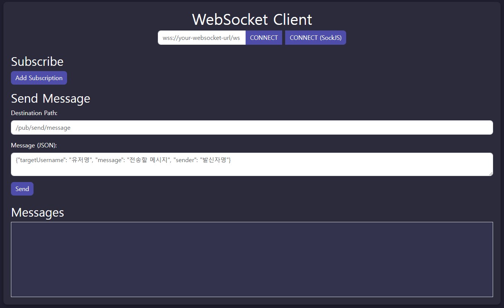

# WebSocket & SockJS STOMP 클라이언트

WebSocket 및 SockJS STOMP 클라이언트입니다. 이 클라이언트를 통해 WebSocket 서버에 연결하고, 주제를 구독하며, 메시지를 전송하고, 실시간으로 수신된 메시지를 확인할 수 있습니다.

## 주요 기능

- **이중 연결 지원**: 순수 WebSocket(`wss://`) 또는 SockJS로 연결 가능
- **동적 구독 관리**: 구독 추가 및 제거 기능
- **실시간 메시징**: JSON 형식의 메시지 송수신
- **현대적 UI**: 반응형 디자인과 다크 테마 적용

## 데모



## 설치 방법

1. **레포지토리 클론:**
   ```bash
   git clone https://github.com/your-username/websocket-stomp-client.git
   cd websocket-stomp-client
   ```

2. **프로젝트 열기:**
   - 선호하는 브라우저로 `index.html` 파일 열기
   - 최상의 결과를 위해 로컬 서버(예: VSCode의 `Live Server`)로 실행

## 사용 방법

### 1. WebSocket 서버 연결

- **순수 WebSocket:**
  1. WebSocket URL 입력 (예: `wss://your-websocket-url/ws`)
  2. **CONNECT** 버튼 클릭

- **SockJS:**
  1. SockJS URL 입력 (예: `https://your-sockjs-url/ws`)
  2. **CONNECT (SockJS)** 버튼 클릭

### 2. 주제 구독

1. **Add Subscription** 버튼 클릭
2. 구독할 경로 입력 (예: `/topic/messages`)
3. **SUB** 버튼 클릭하여 구독 시작
4. 구독 취소 시 **UNSUB** 버튼 클릭

### 3. 메시지 전송

1. **Destination Path** 입력 (예: `/pub/send/message`)
2. **Message**를 JSON 형식으로 작성:
   ```json
   {
     "targetUsername": "user123",
     "message": "안녕하세요!",
     "sender": "clientUser"
   }
   ```
3. **Send** 버튼 클릭

### 4. 메시지 확인

- 수신된 메시지는 **Messages** 섹션에 실시간으로 표시됩니다.

## 사용된 기술

- **HTML5**
- **CSS3 (Bootstrap)**
- **JavaScript (jQuery, Axios)**
- **SockJS & STOMP.js**

## 커스터마이징

- `index.html` 파일의 `<style>` 태그 내 스타일을 수정하여 테마 변경
- 자동 재연결 기능이나 메시지 필터링 등의 고급 기능 추가를 위해 JavaScript 로직 수정

## 문제 해결

- **WebSocket 연결 실패:**
  - URL이 `ws://` 또는 `wss://`로 시작하는지 확인
  - SockJS 사용 시 `http://` 또는 `https://` 사용
  - 서버의 CORS 정책 및 WebSocket 지원 설정 확인

- **구독 또는 메시지 전송 실패:**
  - 구독 또는 메시지 전송 전에 WebSocket 연결이 성공적으로 이루어졌는지 확인
  - 경로가 올바르고 서버 측 설정이 제대로 되어 있는지 확인

## 참고 자료

- [STOMP.js 문서](https://stomp-js.github.io/)
- [SockJS 문서](https://github.com/sockjs/sockjs-client)
- [Bootstrap](https://getbootstrap.com/)
